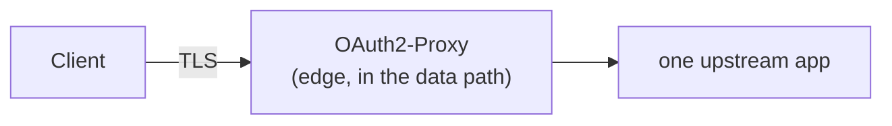
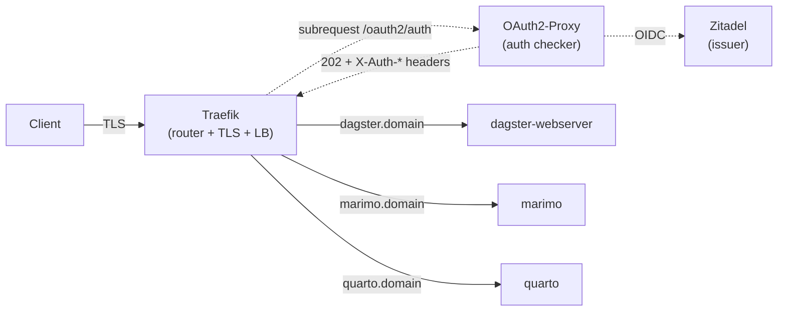
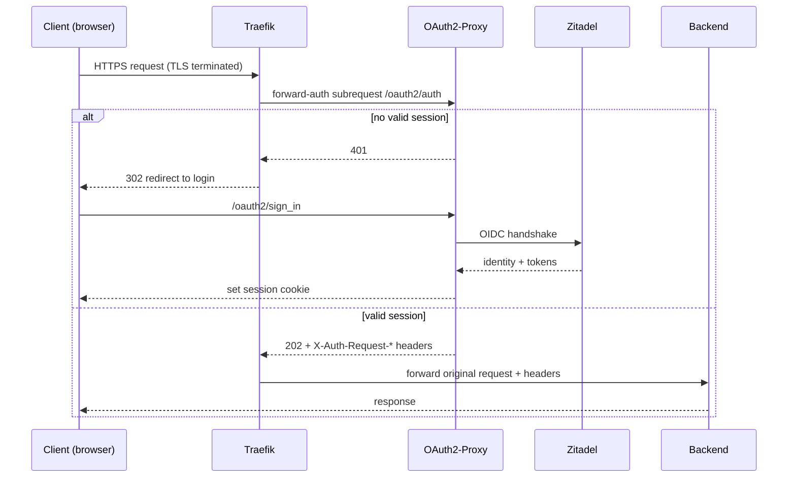
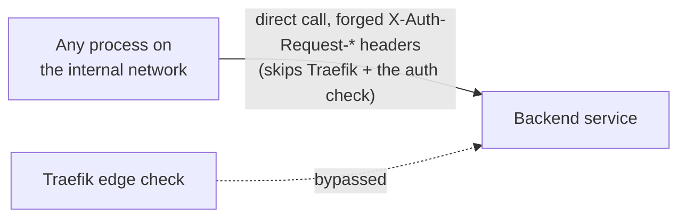
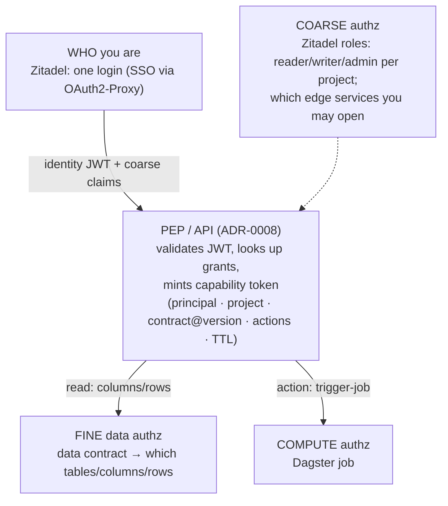
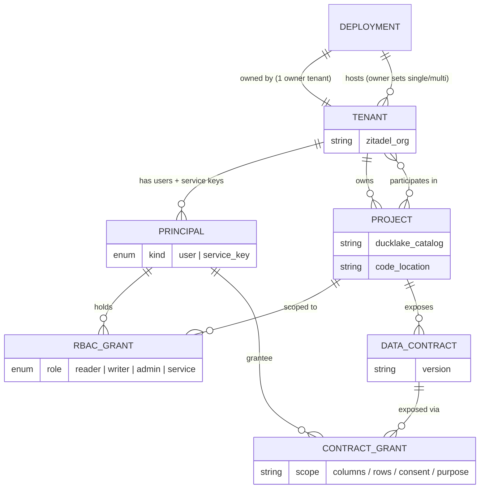
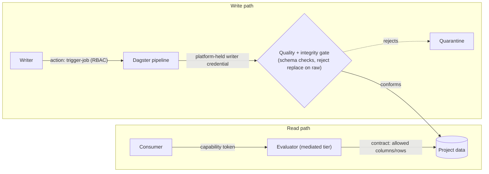

# Architecture & Conventions

## Service topology

Both deployment targets (Docker Compose and Helm) run the same logical services. The full stack has 11 containers (10 running, 1 ephemeral):

| Container | Role | Image | Notes |
|:---|:---|:---|:---|
| `srdp-postgres` | Shared platform database | `postgres:17-alpine` | Hosts databases for Zitadel and Dagster |
| `srdp-traefik` | Reverse proxy, TLS termination | `traefik:v3.5.3` | |
| `srdp-zitadel-init` | Database schema bootstrap | `ghcr.io/zitadel/zitadel:v4.2.2` | Runs once then exits |
| `srdp-zitadel` | Identity provider (OIDC) | `ghcr.io/zitadel/zitadel:v4.2.2` | API, console, OIDC endpoints |
| `srdp-zitadel-login` | Hosted login UI | `ghcr.io/zitadel/zitadel-login:v4.2.2` | Separate Next.js app since Zitadel v4 |
| `srdp-oauth2-proxy` | Forward-auth middleware | `quay.io/oauth2-proxy/oauth2-proxy:v7.6.0` | |
| `srdp-dagster-code` | User pipeline code (gRPC) | Built from `projects/cbs-example/Dockerfile` | Separate so pipeline code can update independently |
| `srdp-dagster-webserver` | Orchestration UI | Built from `deploy/docker/dagster-webserver.Dockerfile` | No source code — connects to code server over gRPC |
| `srdp-dagster-daemon` | Schedule & sensor execution | Same image as webserver | Must be a separate process per Dagster's architecture |
| `srdp-marimo` | Reactive notebook app | Built from `projects/cbs-example/notebooks/` | App content is tenant-owned, unlike quarto's generic runtime |
| `srdp-quarto` | Static reporting site | Built from `services/quarto/` | |

**Why so many containers?** Zitadel requires a one-time init container and ships its login UI as a separate app since v4. Dagster requires three processes by design: the code server (isolates user code), the webserver (UI), and the daemon (runs schedules/sensors/backfills). These cannot be merged without breaking the tools' architecture.

## Background: edge routing & authentication

Three components cooperate at the edge (Traefik, OAuth2-Proxy, and Zitadel), and the relationship between them is a recurring source of confusion. This section is the shared mental model; the mechanical config lives under [Component configuration](#component-configuration).

### Three roles, not three proxies

They are not competing proxies. Each plays a distinct role:

| | Traefik | OAuth2-Proxy (our mode) | Zitadel |
|:---|:---|:---|:---|
| Category | Reverse proxy / router | Authentication checker | Identity provider (OIDC issuer) |
| Moves application traffic? | **Yes**, every request | **No**, only the `/oauth2/auth` yes/no check | No |
| Routes by hostname | Yes (`dagster`/`marimo`/`quarto`) | No | No |
| TLS termination | Yes | No | Terminates its own |
| Load balancing | Yes | No | No |
| Runs the OIDC login flow | No | Yes | Yes (is the issuer) |
| Issues the session cookie | No | Yes | No |

Despite its name, **OAuth2-Proxy is not a general-purpose reverse proxy in this setup.** It *can* run as one (see "standalone" below), but we run it in **forward-auth mode**, where it carries no application traffic and only answers one question (*is this request authenticated?*), running the login redirect if not.
> Keeper sentence: *Traefik routes and load-balances all traffic; OAuth2-Proxy only decides whether a request is authenticated. The reverse proxy cannot be replaced by the auth checker.*

### Why forward-auth, not standalone

OAuth2-Proxy supports two deployment models. We deliberately use the second.

**Standalone (rejected).** OAuth2-Proxy is the edge server and carries every byte to a single upstream:



**Forward-auth (what SRDP runs).** Traefik is the edge and the data path; OAuth2-Proxy sits to the side as an auth oracle:



Per request, as a sequence:



Standalone is rejected because SRDP fronts several apps on separate hostnames behind one Zitadel. Standalone fronts essentially **one** app per instance and lacks host-based routing, multi-domain TLS/ACME, load balancing (algorithms, health checks, failover), and middleware chaining. The reverse proxy is mandatory; the auth checker plugs into it. Traefik could be swapped for nginx/Envoy/a cloud load balancer, but it cannot be deleted in favour of OAuth2-Proxy.

### Traefik is the north-south edge only

Traefik handles **external** traffic (client → platform). It is **not** in the path for **east-west** service-to-service calls, which run directly on the internal network. Traefik is only on `srdp-app` and cannot even reach PostgreSQL on `srdp-db`.

This is why edge authentication is not sufficient on its own:



Any process on the internal network can call a backend directly with forged `X-Auth-Request-*` headers, bypassing the edge check entirely. "It's behind Traefik" is **not** a security guarantee for internal callers. The resolution is that every service making an authorization decision must validate the forwarded Zitadel JWT itself (signature/issuer/audience/expiry) and never trust plain headers (see [ADR-0008](adr/0008-identity-propagation-and-data-contracts.md)).

### What Zitadel authorizes (and what it does not)

Zitadel is the single OIDC issuer: **one user = one login** (one username/password), with SSO across all apps via the shared OAuth2-Proxy session cookie on `.local.dev`. Zitadel covers **authentication** and **coarse authorization** only. Fine-grained data and compute scope live one layer down:



So a data contract is **not** attached inside Zitadel; it is a separate artifact the PEP joins to your Zitadel identity at request time. See [ADR-0008](adr/0008-identity-propagation-and-data-contracts.md) for the capability-token and data-contract model, and the access model below for how subjects and scopes relate.

### Access model: tenants, projects, and grants

The access model uses a small, fixed vocabulary; keeping the terms separate is what keeps it simple.

- **Deployment** — the broadest scope and the strongest isolation boundary. One SRDP instance with its own Zitadel, storage, and PostgreSQL. Nothing crosses a deployment (no tenant, project, grant, or contract); separate deployments are independent islands.
- **Tenant** — an organization (a Zitadel Organization), and the single subject-org term. Each tenant has **principals**: users (people) and service keys (machine-to-machine). One tenant is the **deployment owner**: it owns the deployment and decides single vs multi tenancy and the project landscape; other tenants are admitted as participants. A deployment hosts one or many tenants at the owner's choice. Single-tenant is the recommended default for hard isolation; co-hosted tenants are separated by catalog/project plus RBAC, which is softer than separate deployments.
- **Project** — one DuckLake catalog plus its Dagster code location. Owned by a tenant; the data and pipeline unit. A deployment may also attach non-project catalogs (shared reference data), so not every catalog is a project.

A *consumer* is not a separate entity: it is a participant tenant whose access is contract-scoped read (the shared-BI mode).



**Two tiers of access.** Project access is granted at two grains:

- **Tenant ↔ project (membership, coarse).** Every project has an owner tenant (normally its creator, the deployment owner by default) that controls its grants and lifecycle. Other tenants can *participate* in a project they don't own (the cross-tenant, shared case). Membership gates which organizations may touch a project at all.
- **Principal ↔ project (RBAC, fine).** Within a project the tenant can reach, each principal (user or service key) holds its own role (reader, writer, admin, or a service role). Not everyone in a tenant has the same access.

A principal's grant on a project is valid only if its tenant owns or participates in that project: tenant membership is the outer gate, the principal grant is the actual permission.

**Resource types**, granted through the roles above:

- **Service** (Dagster UI, marimo, quarto, the API): a service role, enforced at the Traefik edge.
- **Compute** (jobs, asset materializations): the writer role's trigger-job capability.
- **Data** (catalog and table, down to columns and rows): project RBAC for coarse access, data contracts for fine scope.

**Tiered by design.** The mandatory core is deployment, tenant, project, principals, and project-scoped RBAC ([ADR-0005](adr/0005-authorization-and-data-access.md)); this is a complete access model on its own. Data contracts, fine column/row/consent scope, contract-scoped consumer access, and finer compute management ([ADR-0008](adr/0008-identity-propagation-and-data-contracts.md), [ADR-0009](adr/0009-data-plane-credential-materialization.md)) are an opt-in layer enabled only when a deployment needs shared BI, regulated data, or per-consumer scope. The core never depends on the optional layer. Fine-grained or shared access does require the contract layer; without it, access is coarse (whole-project).

### Reads vs. writes: what a data contract enforces

A data contract is one artifact doing different jobs depending on direction:

| Direction | Contract's role | What authorizes the principal |
|:---|:---|:---|
| **Read / consume** | enforces fine-grained access (which columns/rows you may see) via the evaluator on mediated tiers | the contract grant itself |
| **Write / ingest** | validates incoming data (schema + quality) | the coarse project writer grant (RBAC) |



Fine-grained, column/row access control applies to **reads**. On the **write** path the contract is a data-quality gate, not a per-principal permission, and that is sufficient, because the write-path risk is **integrity/availability, not confidentiality**: a write can corrupt or destroy data, but it cannot leak it. Write authorization is therefore coarse: endpoint availability + a project-level writer grant.

Two properties must hold for this to stay safe:

- **The ingest gate covers integrity, not just schema.** It must reject destructive writes on raw (the append-only / write-mode invariant, [ADR-0004](adr/0004-data-organization-and-ingestion.md)), not only validate that data conforms; schema validation alone does not stop a `replace` that wipes history.
- **The writer credential is platform-held, never user-held.** The DuckLake Writer role grants `SELECT` alongside `INSERT/UPDATE/DELETE`, so a direct writer connection is also a read-everything connection that bypasses contract-scoped reads. Writes stay leak-free only because the credential lives with Dagster (writes are pipeline-mediated) and the user holds the `trigger-job` action, not the connection. See [ADR-0008](adr/0008-identity-propagation-and-data-contracts.md) and the H1 credential-materialization spike.

## Naming conventions

### Containers

All containers use the prefix `srdp-`:

```
srdp-postgres
srdp-traefik
srdp-zitadel
srdp-zitadel-init
srdp-zitadel-login
srdp-oauth2-proxy
srdp-dagster-webserver
srdp-dagster-daemon
srdp-dagster-code
srdp-marimo
srdp-quarto
```

Every container has an explicit `container_name` in `docker-compose.yml` to prevent auto-generated names.

### Networks

| Name | Purpose |
|:---|:---|
| `srdp-app` | Services exposed via Traefik (HTTP traffic) |
| `srdp-db` | Database access (PostgreSQL only) |

### Volumes

| Name | Purpose |
|:---|:---|
| `srdp-pgdata` | PostgreSQL data directory |
| `srdp-dagster-compute-logs` | Dagster compute log storage |

### Domains

Local development uses `*.srdp.localhost` with mkcert certificates:

| Domain | Service |
|:---|:---|
| `auth.srdp.localhost` | Zitadel |
| `dagster.srdp.localhost` | Dagster webserver |
| `marimo.srdp.localhost` | Marimo |
| `quarto.srdp.localhost` | Quarto |

### Databases

One shared PostgreSQL instance. Each service gets its own database and user, created by `deploy/docker/initdb/01-create-databases.sql`:

| Database | User | Used by |
|:---|:---|:---|
| `zitadel` | `zitadel` | Zitadel identity provider |
| `dagster` | `dagster` | Dagster run/event storage |
| `ducklake` | `postgres` | DuckLake catalog metadata (per-project schemas) |

The `ducklake` database is **not** created by the init script. The DuckLake IO manager creates it on first use (`ensure_database` in `src/srdp/io/ducklake.py`), and each project gets its own metadata schema within it (for example `ducklake_sales`, see [ADR-0006](adr/0006-deployment-and-project-isolation-model.md)). All three databases live in the single PostgreSQL instance, so one backup covers them.

## Component configuration

### PostgreSQL

Shared across all services. The `initdb/` directory runs SQL scripts on first boot to create per-service databases. Adding a new service database means adding a `CREATE USER` / `CREATE DATABASE` pair to the init script.

### Traefik

- Docker provider discovers services via container labels.
- Static routes for Zitadel and Zitadel Login are defined in `config/traefik/traefik.yml` (file provider) because they require `insecureSkipVerify` for the self-signed backend.
- All other services are routed via Docker labels on their containers.
- TLS: mkcert certificates locally (via `tls.stores.default`), Let's Encrypt in production (via ACME cert resolver).

### Zitadel

- Runs with TLS enabled (`ZITADEL_TLS_ENABLED: true`) using the same mkcert certificates.
- `zitadel-init` runs once to bootstrap the database schema, then exits.
- `zitadel-login` is the hosted Next.js login UI, connected via a personal access token generated during init.

### OAuth2-Proxy

- Configured as a Traefik forward-auth middleware (`zitadel-auth`).
- Protects all app services (Marimo, Quarto, Dagster) — requests are redirected to Zitadel for OIDC login.
- The `dagster.srdp.localhost` domain is included in the oauth2-proxy router rule alongside the other app domains.

### Dagster

Three containers, two images:

- **dagster-webserver** and **dagster-daemon** share an image (`dagster-webserver.Dockerfile`) that installs only the `[infra]` extra — no source code. They connect to the code server over gRPC.
- **dagster-code** uses the project Dockerfile (`projects/cbs-example/Dockerfile`) which installs the full `srdp` package plus project code. It runs `dagster code-server start` to expose definitions over gRPC.
- The Helm chart uses `dagsterApiGrpcArgs` to configure the same gRPC server — the Dagster Helm chart manages the command internally, so `code-server` vs `api grpc` only applies to the Docker Compose setup.
- `dagster.yaml` configures PostgreSQL storage and the run launcher (`DefaultRunLauncher` locally, `K8sRunLauncher` in production).
- `workspace.yaml` tells the webserver/daemon where to find the code server (`srdp-dagster-code:3030`).

### Marimo & Quarto

Stateless app containers. No database dependency. Routed through Traefik with the same OAuth2-Proxy auth chain as Dagster.

## Directory layout

```
config/
  dagster/
    dagster.yaml          # Dagster storage & run launcher config
    workspace.yaml        # Code server location
  traefik/
    traefik.yml           # Traefik static configuration
deploy/
  docker/
    docker-compose.yml    # Local development stack
    docker-compose.override.yml  # TLS cert mounts
    dagster-webserver.Dockerfile
    initdb/               # PostgreSQL init scripts
    certs/                # mkcert certificates (gitignored)
  kubernetes/
    srdp-chart/           # Helm umbrella chart
projects/
  cbs-example/            # Example Dagster project
    Dockerfile
    src/etl/
    notebooks/            # Marimo notebook (tenant-owned content)
services/
  quarto/
src/
  srdp/                   # Core platform library
```
