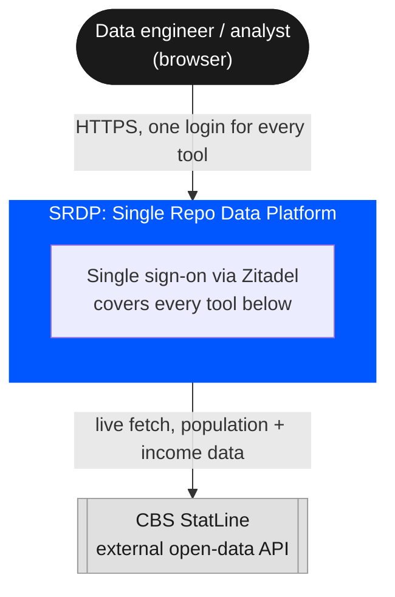
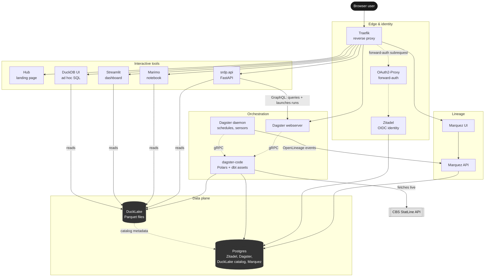
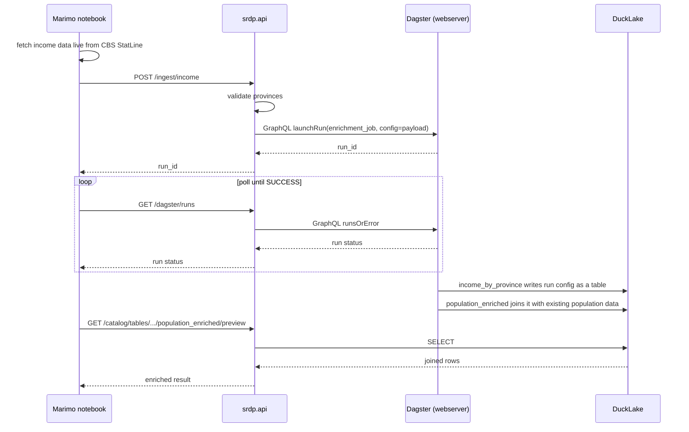

# cbs-example

The reference tenant project for SRDP (see [ADR-0006](../../docs/adr/0006-deployment-and-project-isolation-model.md)).
It is not a toy, but it is also not where real client code lives.
It's the thing you'd copy and rename to start a new project, and it's what this repo's own local demo runs.

It shows two ways to define a pipeline against the same DuckLake catalog, Polars and dbt, a third pipeline style triggered by a push rather than a schedule, and several ways to read the result: a Streamlit dashboard, a Marimo notebook, DuckDB's own UI, and a small FastAPI surface, all under one Dagster code location.

> **Note on this README:** the sections below "What this session added" are a draft. They cover platform-wide pieces (lineage, the API, DuckDB UI) that arguably belong in `docs/03-architecture.md` rather than a tenant project's README, written here first for review before being promoted there. See [ADR-0006](../../docs/adr/0006-deployment-and-project-isolation-model.md) on why that split matters.

## What's in here

| Path | What it is |
|:---|:---|
| `src/etl/assets/example.py` | The Polars pipeline: fetches live population data from CBS StatLine, writes through `ducklake_io_manager` |
| `src/etl/assets/dbt_assets.py` | Wires the dbt project into Dagster via `@dbt_assets` |
| `src/etl/assets/enrichment.py` | `income_by_province`/`population_enriched`: takes its data as run config rather than fetching it, see "Push-based enrichment" below |
| `src/etl/definitions.py` | The code location's `Definitions`: assets, jobs, schedules, resources |
| `dbt/` | A standalone dbt project (models, tests, `profiles.yml`) that aggregates the same population data independently in SQL, as a cross-check against the Polars output |
| `streamlit/app.py` | A dashboard reading the DuckLake catalog directly (KPIs, charts) |
| `notebooks/app.py` | A Marimo notebook: explores the catalog, and separately simulates an external caller pushing data through the API |
| `Dockerfile` | Builds the `dagster-code` image, which is what `docker-compose.yml` and the Helm chart actually deploy |

## What the pipeline does

Source: CBS StatLine table `70072ned` ("Regionale kerncijfers Nederland"), fetched live over the CBS OData v3 API.
It is real Dutch government open data, not synthetic, and needs no API key.

Assets, in dependency order:
1. `raw_population`: population per province × age bracket, one row grain
2. `population_by_province` / `population_by_age_group`: two aggregations (Polars)
3. `cbs_dbt_assets`: the dbt project's models and tests, reading `raw_population` and producing `population_by_province_dbt`
4. `top_province` / `executive_summary`: small scalar outputs, not written to DuckLake (see note below)

`population_by_province` (Polars) and `population_by_province_dbt` (dbt) compute the same thing independently.
You can verify they agree yourself. See "Checking the data" below.

### Why some assets don't show up as DuckLake tables

The `ducklake_io_manager` only knows how to write `pl.DataFrame`/`pl.LazyFrame`.
`top_province` and `executive_summary` return plain strings (a scalar answer, not a dataset worth cataloging), so they don't set `io_manager_key="ducklake_io_manager"` and fall back to Dagster's default in-memory IO manager instead.
This is deliberate, not an oversight: passing a string to `ducklake_io_manager` would fail at write time.

## Setup

From the repo root:

```bash
# One-time: local CA + TLS certs for the *.srdp.localhost stack
brew install mkcert
mkcert -install
just docker-tls

# Environment file (defaults are fine to start; see "First login" below)
cp deploy/docker/.env.example deploy/docker/.env

# Build and start everything
just docker-up
```

`*.srdp.localhost` resolves to `127.0.0.1` automatically, since it's under the reserved `.localhost` TLD, so no `/etc/hosts` edit is needed.

### First login: creating the OIDC application

Zitadel doesn't know about `oauth2-proxy` until you tell it. On a fresh stack:

1. Open `https://auth.srdp.localhost`, sign in as the first-instance admin (see `docs/02-configuration.md` for the default login name/password).
2. Create a project and a **Web** app with the **Code** auth flow, redirect URIs for each service (`https://dagster.srdp.localhost/oauth2/callback`, `.../marimo...`, `.../streamlit...`, `.../srdp.localhost/oauth2/callback` for the hub; see `docs/02-configuration.md` for the full list).
3. Copy the generated client ID/secret into `deploy/docker/.env` (`OIDC_CLIENT_ID`, `OIDC_CLIENT_SECRET`), then `docker compose up -d --force-recreate oauth2-proxy`.

This is the known, documented bootstrap gap (tracked as issue #35).
It is not specific to this project: every service behind the shared SSO gate needs it done once per fresh Zitadel instance.

## Running the pipeline

Either trigger it from the Dagster UI (`https://dagster.srdp.localhost` → materialize `srdp_etl_job` or select assets individually), or from the CLI inside the running container:

```bash
docker exec srdp-dagster-code env PATH="/app/.venv/bin:$PATH" \
  dagster asset materialize -f /app/projects/cbs-example/src/etl/definitions.py --select "*"
```

It's also on a schedule (`etl_schedule`, every 5 minutes) once the Dagster daemon is running.

## Using it

Once materialized:

- **Dagster** (`https://dagster.srdp.localhost`): asset graph, run history, the dbt tests as native asset checks, column-level lineage on the two Polars aggregations
- **Marimo** (`https://marimo.srdp.localhost`): a reactive notebook querying the same catalog, with a province picker, plus the push-based enrichment demo
- **Streamlit** (`https://streamlit.srdp.localhost`): the population dashboard
- **DuckDB UI** (`https://duckdb.srdp.localhost`): ad hoc SQL directly against the catalog, the official `ui` extension
- **Marquez** (`https://marquez.srdp.localhost`): the OpenLineage lineage graph, fed automatically from every pipeline run
- **SRDP API** (`https://api.srdp.localhost/token`): shows your own access token and how to call the API with it; `/docs` has the interactive Swagger UI
- **Hub** (`https://srdp.localhost`): links to all of the above in one place

One login covers all of them (shared SSO cookie domain, `.srdp.localhost`).

## Checking the data

Any of the above containers can query the catalog directly:

```bash
docker exec srdp-dagster-code /app/.venv/bin/python3 -c "
from srdp.io.ducklake import setup_ducklake
conn = setup_ducklake()
print(conn.sql('''
    SELECT p.province, p.total_population AS polars_total, d.total_population AS dbt_total,
           p.total_population = d.total_population AS match
    FROM ducklake.main.population_by_province p
    JOIN ducklake.main.population_by_province_dbt d USING (province)
'''))
"
```

## Running dbt on its own

The `dagster-code` container already has `dbt`, the project, and (via the shared `ducklake-data` volume) the actual Parquet files, so that's the easiest place to run it directly, without Dagster orchestrating:

```bash
docker exec -w /app/projects/cbs-example/dbt srdp-dagster-code \
  env PATH="/app/.venv/bin:$PATH" DBT_PROFILES_DIR=. dbt build
```

`profiles.yml` attaches the same DuckLake catalog Dagster writes to (`ducklake:postgres:...`, via `dbt-duckdb`'s native `is_ducklake`/`override_data_path` support, reading the `DUCKLAKE_*` env vars already set on that container).
There's no separate "dbt's own copy of the data."
Running it from a plain host shell instead needs `DUCKLAKE_DATA_PATH` pointed at wherever the `ducklake-data` volume is actually mounted, which is why the container is the simpler path.

## Using this as a template for a new project

Copy this directory, rename it, and update:
- `projects/<new>/src/etl/definitions.py`: your assets/jobs
- `projects/<new>/dbt/`: your dbt project (or delete it if you're not using dbt)
- `projects/<new>/Dockerfile`: no changes usually needed, it's generic
- `deploy/docker/docker-compose.yml`: point `dagster-code`'s build context at the new Dockerfile

See `.github/instructions/dagster.instructions.md` for the platform-wide conventions (IO manager usage, asset key → catalog mapping) any new project should follow.

---

## What this session added (draft, pending review)

Everything below documents the full current stack: lineage, the API, DuckDB UI, and the push-based enrichment flow. Diagrams are plain Mermaid flowcharts drawn in [C4 model](https://c4model.com/) layers (System Context, then Container), not the literal `C4Context`/`C4Container` Mermaid diagram types, those exist but Zensical (this repo's docs site generator) doesn't officially support them ("doesn't work well on mobile," per its docs), while flowcharts are fully supported and already used in `docs/03-architecture.md`.

### System context

Who and what talks to SRDP, at the level someone outside the platform would care about:



### Containers

All 17 containers the stack runs, grouped by role:



### Push-based enrichment

Every asset above is *fetched* by Dagster on a schedule. This flow runs the other direction, the Marimo notebook simulates an external caller: it fetches fresh CBS income data itself, then pushes it into the platform through the API, which triggers a Dagster run rather than a scheduled one.



`income_by_province` and `population_enriched` (`src/etl/assets/enrichment.py`) live in their own `enrichment_job`, deliberately kept off `srdp_etl_job`'s cron schedule, `income_by_province` takes its data as run config rather than fetching it, so a scheduled run with no payload would overwrite real data with nothing.

### Your own access token, for calling the API outside a browser

`https://api.srdp.localhost/token` shows the signed-in user their own Zitadel access token and a ready-to-copy `curl` example. No separate API-key system exists, oauth2-proxy already had this token (`--set-xauthrequest` sets it as `X-Auth-Request-Access-Token` on its own `/oauth2/auth` response), it just wasn't in Traefik's forwarded-header allowlist yet. The same token works back as a `Bearer` header on later requests, `--skip-jwt-bearer-tokens` + `--extra-jwt-issuers` on oauth2-proxy validates it against Zitadel's JWKS instead of requiring a session cookie.

### DuckDB UI: reachable, then actually working

Getting the official `ui` extension to work behind Traefik took three separate fixes, each confirmed by direct testing, not assumed from documentation:

1. **The `ui` extension only binds `[::1]`** (IPv6 loopback), no config option for `0.0.0.0`. Confirmed in [`duckdb-ui` issue #22](https://github.com/duckdb/duckdb-ui/issues/22): "the UI server is currently hardcoded to listen to localhost only." Worked around with a proxy in front of it inside the same container.
2. **Traefik's own error-rewrite middleware was hijacking DuckDB's internal 401s.** `zitadel-errors` turns *any* `401` in a response chain into a login redirect, meant for oauth2-proxy's own auth failures, but it doesn't distinguish those from a `401` the actual backend returns for its own reasons. DuckDB UI's frontend calls its own endpoints (`/localToken`, `/ddb/run`, `/ddb/interrupt`, `/ddb/tokenize`, `/localEvents`, found by reading its own JS bundle) that can legitimately 401, and those got rewritten into broken CORS redirects. Fixed with a second, more specific Traefik router for exactly those paths, carrying only the real auth check, not the rewrite.
3. **DuckDB's server independently rejects anything that doesn't look like genuine unproxied `localhost` traffic**, confirmed by testing the *exact* blog-post-recommended access pattern (bare `http://localhost:4213`, zero proxy) and still getting `401`. [`duckdb-ui` issue #209](https://github.com/duckdb/duckdb-ui/issues/209) is the same symptom, reported by someone else, closed "not planned" by the maintainers, no official fix. The actual fix came from a community project that hit this exact wall: [`skyscopetech/duckdb-ui-remote-docker`](https://github.com/skyscopetech/duckdb-ui-remote-docker) runs an HAProxy in front of DuckDB UI that rewrites `Host`/`Origin`/`Referer` to look like a genuine `localhost` client and strips every `X-Forwarded-*` header. Adapted that exact config into `services/duckdb-ui/haproxy.cfg` (their HAProxy also terminates its own TLS; not needed here, Traefik already does that upstream).

Two smaller things fell out of building this. HAProxy's wildcard bind could grab the port before DuckDB's own bind completed. That failed silently, inside a background thread with no visible error, so `entrypoint.sh` now polls until DuckDB is actually listening before starting HAProxy, instead of a fixed sleep. Separately, `/localEvents` needs long HAProxy timeouts specifically, since it's a persistent SSE stream rather than a single request/response call.

### The Marimo notebook as an API client

`notebooks/app.py` is also used to test the unified SRDP API: retrieving information from multiple components and the data itself. The last few cells can also add data to the platform, triggering an ingest pipeline (the "Push-based enrichment" flow above).
